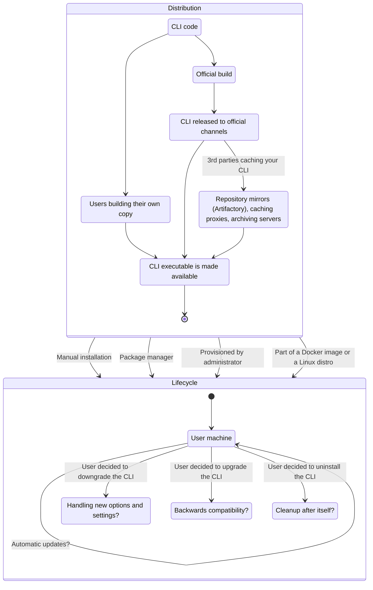

When making decisions in an existing CLI application, or designing a new one, you should **consider specific parts of the CLI application's lifecycle**. It differs from a web application or a service, where you can easily update the code and the users will get the new version the next time they visit the website. CLI applications are much closer to desktop applications.

<!--more-->

## What is a CLI application lifecycle?

In this simplified, but already too complicated diagram below, you can see two major parts: **Distribution** and **Lifecycle**:

This page will focus on the **Lifecycle** part of the diagram: **what is happening with the CLI application once it's installed on the user's machine**. Management of the installed application is in the hands of the user. It's not uncommon that CLI applications stay unchanged on a user machine for years. But their options could be dictated by the way you designed your application.

## Installing CLI application

Installation method used will determine user options. For example if a user used a package manager installation path, then lifecycle parts like **upgrading, downgrading and uninstalling are handled by the package manager**. At the same time, auto-upgrading, unless specifically designed to work well with a package manager, could be problematic.

{}

Read more about the [CLI Distribution aspect on a dedicated page]().

{}

## Autoupdate mechanism

- If you implemented auto update, how good is the experience for users deciding to stick to an older version?

## Upgrading CLI version

- Keep settings untouched, or talk to the user
- rollbacks
  - Handling previous secrets and options
    - For example, when changing a structure of a config file, you will probably include a code to handle or upgrade the old structure. But can your code handle and inform users they are using a structure that’s too new?

## Downgrading CLI version

## Uninstalling CLI

- clear caches
- clear config store

Upgrading
