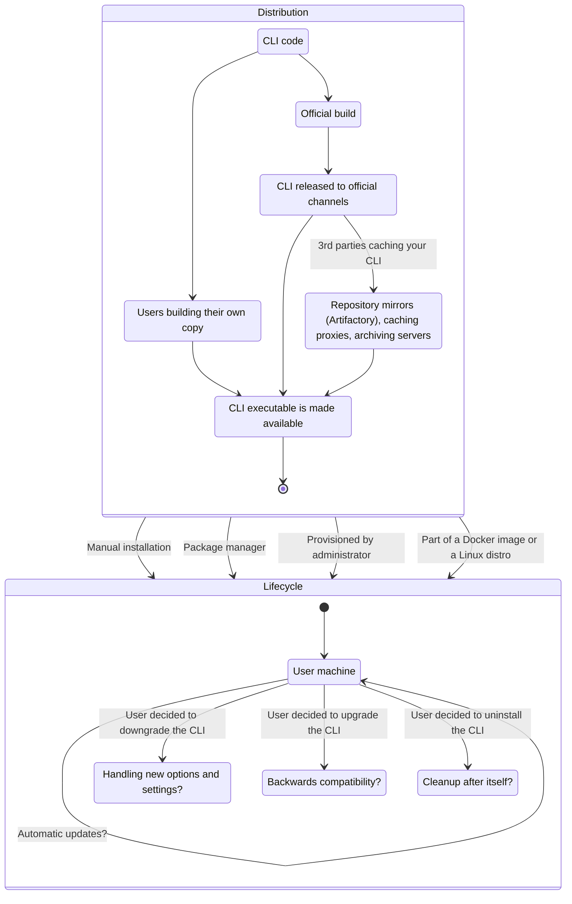

When making decisions in an existing CLI application, or designing a new one, you should **consider specific parts of the CLI application's lifecycle**. It differs from a web application or a service, where you can easily update the code and the users will get the new version the next time they visit the website. CLI applications are much closer to desktop applications.

<!--more-->

## What is a CLI application lifecycle?

Capturing what happens to a CLI application, once it's written is a complex task. It's not just about the code, but also about the distribution, installation, and the way the application is used. It's also about **the way the application is upgraded, downgraded, and uninstalled**.

There are many lessons to be learned from desktop applications, classical server application, and even mainframe programs.

In this simplified, but already too complicated diagram below, you can see two major parts: **Distribution** and **Lifecycle**. This page will focus on the **Lifecycle** part of the diagram: **what is happening with the CLI application once it's installed on the user's machine**. A few things you want to keep in mind:

- **The machine belongs to the user, your application is a guest.**
- Users have **good** reasons to...
  - ... stay on a specific version of the CLI, without upgrading. Even for _years_ and possibly longer. Possibly because they deployed it in a place where they can't easily modify it.
  - ... configure and use the application in ways you never imagined. Or recommended.
  - ... switch between versions and installation methods back and forth. Or even run multiple versions installed with different package managers on the same machine.

---

Management of the installed application is in the hands of the user. It's not uncommon that **CLI applications stay unchanged on a user machine for years**. But their options could be dictated by the way you designed your application.

## Installation method matters

The installation method used will determine user options. For example, if a user used a package manager installation path, then lifecycle parts like **upgrading, downgrading and uninstalling are handled by the package manager**. At the same time, auto-upgrading, unless specifically designed to work well with a package manager, could be problematic.

{}

Read more about the [CLI Distribution aspect on a dedicated page]().

{}

## Upgrading CLI version

{}

See the [Versioning]() page for additional context.

{}

A new version of the CLI should handle previous secrets and options. Are you supporting _very_ old versions? You should [version your config files and secrets](), and handle the upgrade process. Will you update the configuration files once they were loaded or validated for the new version as well?

### Why are old versions a problem?

For CLI authors, especially if you are working on a commercial product, keeping the [long tail](https://en.wikipedia.org/wiki/Long_tail) of old versions shorter is preferable. This will greatly help with rolling out security patches, new functionality or even auditing.

<!--
Users might not care too much. If the tool gets the job done, there isn't an incentive to upgrade.

Traditionally, this wasn't a big issue. As a user, you want to be reasonably recent for bug fixes, and compatibility patches.
In recent decade or so security -->

### Auto-update mechanism

{}

**Auto-updating software deserves a dedicated page.** It's right on the border of Distribution and Lifecycle. Read more about [the mechanics of CLI auto-update on a dedicated page]().

{}

From the lifecycle angle, it's important to consider:

- If you implemented auto-update, how good is the **experience for users deciding to stay on a specific version**?
- Do you **respect different installation methods**? E.g. if users are installing your application from the local mirror or Artifactory, will you fetch the new version from there? Or will you try to use your global store?
- Do you have different policies for e.g. security patches vs. major releases with breaking changes?
- How do you handle **a breaking change for auto-updating users**?

### Releasing a breaking change

When it comes to upgrading, especially auto-upgrading, you need to account for a chance of releasing a breaking change. Letting auto-update install the breaking change could lead to your application **breaking someone else's workflows, automation or even a production system**.

Avoiding the breaking change will in a better case **lead to a fractured user base**, with some users staying on the previous version indefinitely and in a worse case requiring you to support and patch multiple branches (v1 & v2 for example) of your application.

Requiring user input to confirm the upgrade is a good middle ground, however, is not practical if most of the users are using the application in an automated fashion, where they won't see the prompt.

## Downgrading CLI version

Users may also downgrade to a previous version - for compatibility reasons or because the new version introduced regressions. Or they just tested a prerelease version of your application. **How does your CLI behave in cases where it encounters an unknown (future) configuration version?** [Be explicit with your error messages.]()

## Uninstalling CLI

When you use configuration files and caches, do you clean them up when the user uninstalls your application? Can you run a clean or post-installation hook for all different installation methods? If not, do you have different cleanup behaviors for different users?
