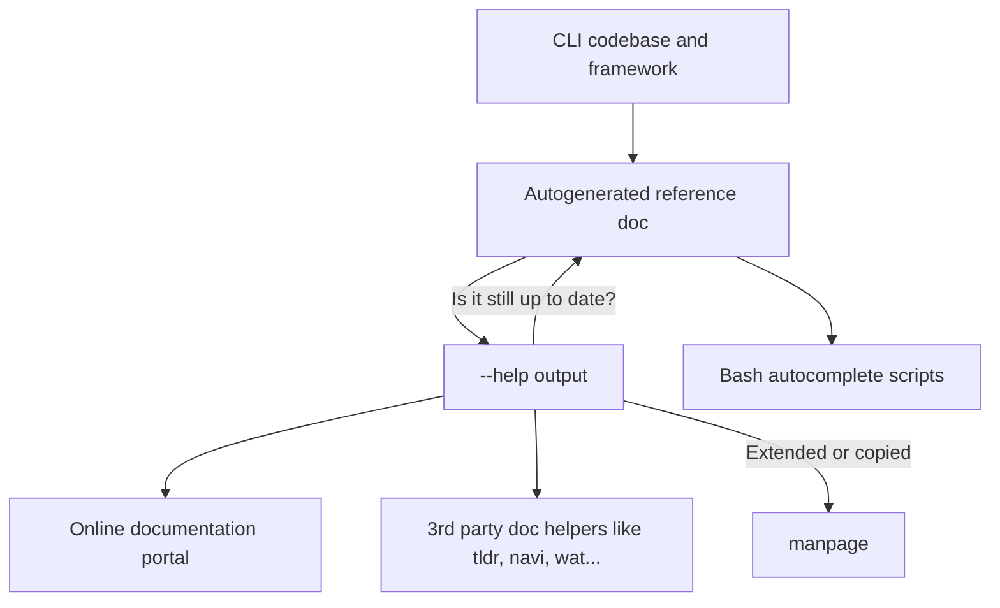

The Help page is often the first output the user sees from your command. This page discusses different ways of creating a Help document and making it available to the users.

<!--more-->

## How to write CLI Help

It's important to remember, that Help is here for the users. A good Help should answer these questions right away:

1. What does your program do?
1. Where to begin?
1. How can I learn more?

When trying to answer these questions, **always assume the user doesn't know anything about your application**. They randomly discovered it and maybe they hope it can help them with a task.

### 1) What does your program do?

There are a few things to help new users understand what your CLI application does:

- Provide a _one-liner_ description. A sales pitch to explain why your application exists.
- A longer description of goals or capabilities if needed
- Link to the project's website or relevant documentation site

### 2) Where to begin?

Is there a recommended **sample command** to run for new users? Provide examples and common use cases.

If your CLI is tied to another product or a website, don't assume users are aware of it. Or they already have accounts or API keys. Be explicit if they should familiarize and/or register themselves with a website/SaaS before they use the application.

### 3) How can I learn more?

Show possible **Subcommands & Options** or guide users towards more detailed documentation. You could also describe additional use cases.

You could build on that and also describe other parts of the program, for example:

- [Possible exit codes]() and their meaning
- Links to project homepage, repository, documentation, other integrations…

## Writing or generating?

CLI Help can act as _reference material_ listing and explaining all available commands and options. But it could also have a much broader scope and document recommended usage, design considerations and other advanced topics.

When documenting your application, you should decide whether you want to provide a _Reference_ or _Documentation_. This is not a binary choice, there is a lot of room for finding a solution that works best for your use case. Regardless, most likely **you will want to have both!**

### Long and short versions

Let's take a look at these two approaches. A pattern you can see fairly often is to have two or more versions of the CLI documentation. For example:

- a short one, acting as a quick _reference_
- a longer document, describing all the options and settings in detail
- a documentation portal or a manpages, describing everything in full details

### Reference

Could be a very minimal document. Most often seen as a listing of options and commands, **without guiding users or explaining** usage in detail. See an example output of [man]():

```text
$ man -h
Usage:
 man [-adho] [-t | -w] [-M manpath] [-P pager] [-S mansect]
     [-m arch[:machine]] [-p [eprtv]] [mansect] page [...]
 man -f page [...] -- Emulates whatis(1)
 man -k page [...] -- Emulates apropos(1)
```

- Short, describes available commands, options and their allowed usage.
- Ideally is generated from the CLI application code to stay always up to date.
- Avoids complex topics like configuration, deployment scenarios etc.

If you are using a [CLI framework](), it can **generate a CLI help from flags and options defined in the application code**. This way, your help document never goes out of sync with the implementation.

Having such programatically controlled reference of all possible options and commands is extremely useful. For example, it could be **exported into multiple formats**. And feeds into other **integrations like [autocomplete]()**. Or used to validate **if all options described elsewhere are still valid**. Or generate automated testing. And many more.

However, unless your application is a straightforward utility, such a concise document **might not help users**. This is where a more detailed explanation in documentation can help.

### Documentation

Such documentation will **involve human input**. It could be the CLI developer adding descriptions to options definitions in code. Or a technical writer manually updating the Help document.

Such document could be sourced, templated or validated with the help the autogenerated Reference. It could then be made available online, on the CLI documentation portal. Or exposed in abbreviated form on CLI reference tools or even extended for the application's [manpage]().

Example of fetching a manual page for [man]() command:

```text
$ man man
NAME
     man, apropos, whatis - display online manual documentation pages

SYNOPSIS
     man [-adho] [-t | -w] [-M manpath] [-P pager] [-S mansect]
         [-m arch[:machine]] [-p [eprtv]] [mansect] page ...

     man -f [-d] [-M manpath] [-P pager] [-S mansect] keyword ...
     whatis [-d] [-s mansect] keyword ...

     man -k [-d] [-M manpath] [-P pager] [-S mansect] keyword ...
     apropos [-d] [-s mansect] keyword ...

DESCRIPTION
     The man utility finds and displays online manual documentation pages.  If
     mansect is provided, man restricts the search to the specific section of
     the manual.

     The sections of the manual are:
           1.   General Commands Manual
           2.   System Calls Manual
           3.   Library Functions Manual
[...]
```

- Describes available commands, options and their allowed usage, but in great detail.
- If you are not validating it, it could be out of sync with application behavior or available options.
- Written by human

In a complex and mature CLI application, you could see these approaches working, extending and validating each other.



## Formatting and displaying CLI Help

There isn't a _proper_ standard for formatting CLI help pages. However, there are some common patterns and conventions to follow. A good starting point is to follow the structure and output of [man pages](). In general, it should look like this:

1. Name, Description and version
1. Usage and example usage
1. Available commands and options
1. Usage of other configuration options like environment variables or config files

The most common way is to provide flags `-h` and `--help`. Having a dedicated `help` command is also a good practice. Using this flag should always print help text to `stdout` and not to `stderr`, ignoring other flags that are set. You can provide a help text specific to subcommands. For example:

### CLI Help template

```text
$ multipush --help
{}
```

### Showing help by default

You may **print the Help text on running your app without any arguments** and use it as an introduction for new users:

```console
$ multipush
[Contents of --help]
```

However, if your application has a meaningful, primary action it can take it might make sense to run this action, without requiring users to specify additional options or commands.

Or print Help, or only relevant parts of it, when CLI is invoked with missing or invalid options:

```console
$ multipush -a action.sh
Missing "target" option! Use --target

Welcome to multipush!
```

### Using a Pager for longer documents

You may invoke a [Pager]() when displaying help. **This behavior could confuse users.** They might not know that they can scroll up and down. Or they might not know that they can search for a specific term. They might not know how to exit the Pager. Asking for `aws help` as a new AWS CLI user will transport you to a [Pager]() screen without any usage instructions.


An argument for avoiding the pager is that experienced users can invoke the pager themselves with a pipe `$ multipush | less`, but it's a massive obstacle for less experienced users.

<!--


## Writing or generating a help text

### Generate help with frameworks

### Plain text files

### man page

Manpages (manual pages) are

Sphinx can generate them. How you can actually distribute them depends on the distribution channel you’ll employ.

You could provide a `man` subcommand: `$ multipush man`

### HTML

### PDF

### Docopt
-->

## Handling typos and wrong commands

Handling typos and invalid usage in CLI apps is an interesting challenge. Finding a good balance, depending on your tool’s audience and usage should be taken seriously. These behaviors are often configurable within your framework or arguments parsing libraries.

For example, [npm CLI](https://www.npmjs.com) is doing a very good job. In the example below, the user mistyped a local-context command `npm start`. A few things to point out in this short output:

1. Failure is the first line of output, making it clear what happened
1. Providing alternative spellings even outside of the local context, by providing a global `npm stars` command
1. The _Did you mean_ section is leveraging a description of alternative commands to try
1. In the end, the user is offered a way to list all available commands with `npm run`

```text
$ npm run star
npm ERR! Missing script: "star"
npm ERR!
npm ERR! Did you mean one of these?
npm ERR!     npm stars # View packages marked as favorites
npm ERR!     npm start # Start a package
npm ERR!
npm ERR! To see a list of scripts, run:
npm ERR!   npm run
```

Being strict, and requiring all options to be typed correctly, with valid values and even in a specific order leads to a predictable CLI. With helpful error messages guiding users to a correct configuration. And consistent types and values for processing.

_But it could be limiting_ - maybe your validation is too strict and won’t allow for a perfectly valid value you didn’t think of? For example a validator for file path will reject a network path when it expects a local one. Or maybe your CLI is used in an environment where some other tool appends a meaningless and harmless option flag, that your CLI outright rejects. When you attempt to remove a flag, even in a manner where you don’t break functionality, suddenly users need to update all their usage and remove such flag.

On the other hand, being too lenient will lead to user’s frustration when they mistype or misuse an argument. You could also interpret is as _CLI lying to the user_, as it silently accepts wrong arguments. Typos in flag names are very common and without a warning message it makes your CLI looks like it’s ignoring user commands.

There is a case for both of these approaches. **You should think about design goals of your CLI** - maybe you want to ignore some things, like extraneous flag? Or a file path that looks invalid - if it’s indeed an invalid path, your application will eventually fail with a correct „Not a valid path“ error message. Or just warn on invalid values and typos instead of failing execution? Allowing users flexibility with their flags? And fail validation only on things you are sure would lead to a broken execution?

<!--
## Notes

### Reference tools like `tldr`, `wat`, `navi` or `Dash`

[https://github.com/agarrharr/awesome-cli-apps#command-line-learning](https://github.com/agarrharr/awesome-cli-apps#command-line-learning)

## See more

- defining flags
- Colors and formatting in CLI
-->
