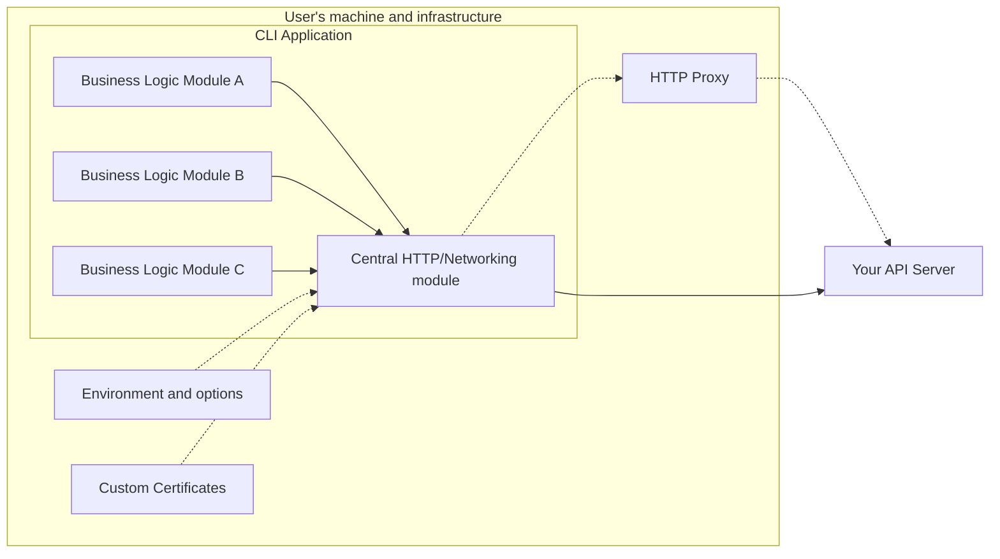
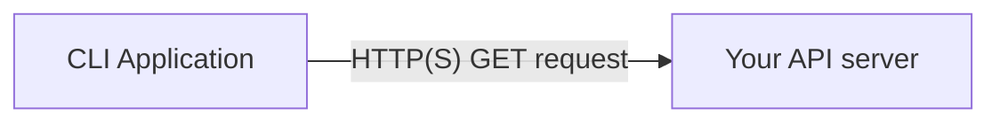
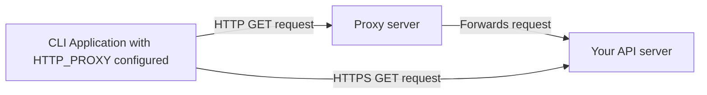

What to consider when your CLI application needs to make network requests? Solid yet flexible networking is a sign of a mature CLI app. [Different flavors of proxies](), custom certificates, and additional auditing & security layers are very common.

<!--more-->

If your CLI needs to make a network request to call an API, fetch a resource or [send analytics data](), you should be aware of a few pitfalls you can encounter. Your language/framework networking libraries will try to take care of some of these. But you should be aware of what they support and where they fall short.

## Architecture

Replacing or upgrading networking libraries, frameworks or languages comes with a **high risk of altering some functionality**. This is amplified by the fact that testing many such configurations, that your users rely on, is very time-consuming and brittle.

<!-- // IDEA: a generic test harness for this? -->

For this reason, it might be a good idea to **centralize networking functionality in your CLI into a single shared module**. This allows you to stick to a single implementation. Otherwise, you are at risk of inconsistencies like some of your requests working while others are failing under certain configurations.



## HTTP(S) Proxies

Proxies are more common than you think and it’s a good idea to **make your CLI app _proxy-aware_**. There are many different flavors of proxy setups you can encounter. There is a good chance that your current tooling/framework already supports the most common ones.

**Some proxies will act only as a tunnel**, to allow your tool to communicate with users’ internal tools and services. **Some will act as a man-in-the-middle**, trying to read your CLI app’s traffic for logging or auditing. Some will act as gatekeepers, blocking or modifying your traffic - for example, to prevent leaks of private information.


Let's take an example where your CLI Application needs to make a GET request to your API service. Your API service is available on HTTPS and its URL is `https://api.my.service`. In your application, you are making a call similar to this:

```python
requests.get('https://api.my.service')
```

### No proxies setup

When making an API call without any proxy configured, your request will get routed directly to the API server using the defined protocol like `https://`.



In this scenario, your CLI talks directly to your API server. And if the request is using `https://` protocol it does a [TLS handshake](https://www.cloudflare.com/learning/ssl/what-happens-in-a-tls-handshake/) and receives the reply in a secure tunnel.

### HTTP or HTTPS proxy

The most common and basic type you will encounter is the HTTP(S) proxy. This is most commonly configured with environment variables `HTTP_PROXY`/`http_proxy` or `HTTPS_PROXY`/`https_proxy`. You could also encounter a [`NO_PROXY`/`no_proxy` value]()!

For example, if you have only `HTTP_PROXY=http://proxy.internal:9000` defined, then **only `HTTP` requests will use it**. `HTTPS` requests will try to connect directly to the API server.



Be careful!

- **There isn’t a formal standard** for values! It’s implementation dependent.
- `HTTPS_PROXY` proxy itself **does not need to be an HTTPS service**. It only defines that _HTTPS traffic_ will be routed through it! E.g. `HTTPS_PROXY=http://proxy.internal:9000` is a valid scenario.
- If you are using [other transport mechanisms and protocols](), you might have to implement proxy configuration options for these as well. E.g. `FTP_PROXY`

{}

**Note on priority**

In rare cases, you will encounter _both lowercase and uppercase_ `http_proxy` & `HTTP_PROXY` environment variables setup. You should make a conscious decision to prefer one over the other. The **lowercase `http_proxy` predates its capitalized version**, it’s usually taking a precedent. Albeit **capitalized version is more common today** because environment variables are nowadays usually defined in capitals. It might be a good idea to log which proxy is used for each request as part of you debug output.
{}

### NO_PROXY

You may also encounter a `NO_PROXY` variable in the wild. Support and feature set here are even more complicated than in the case of `HTTP_PROXY` options. Again, [listen to your users]() and be mindful of which implementation you want to use and document it.



### Proxy authentication

Some proxies will require your CLI to authenticate before a request could be fulfilled.

#### Token-based authentication

#### Basic Auth

#### mTLS

### Using transport mechanisms other than HTTP

There are other transport mechanisms and protocols your CLI might rely on.

It’s a good idea to have a fallback to HTTP. Good example is a Socket.io’s WebSocket implementation that [fallbacks to long-polling HTTP](https://socket.io/docs/v3/how-it-works/) when WebSockets are not available.

## IPv4 & IPv6 considerations

## Allowed domains and IP ranges

It’s a good idea to create a list of domains and/or IP ranges that the CLI will be connecting to. This could be your API/Auth servers, CDN for static files, analytics provider etc.

This list will help users & integrators with audits or network teams creating firewall exception for your CLI.

It could also be integrated into your networking module to create an allowed list of domains.

## Setting an identifier header

Including a specific header into your CLI requests, like an User Agent or your own `X- header` will allow others to recognize your CLI version and act on it, in case you are calling APIs you don’t control. For example cURL’s default user agent is …

You may want to include multiple pieces of information to your custom user-agent:

- App version
- Platform (OS, architecture…)

## Security

Note:
This section is from the CLI’s point-of-view. Securing network traffic and data in transport is too big of a topic. See OWASP or similar for more broader guidelines: [https://owasp.org/](https://owasp.org/)

Use HTTPS traffic when possible. Otherwise you will run into firewall rules blocking everything else.

Token and secret storage: see standalone section on secret storage

## A word on a reasonable support

You probably can't support and test all the scenarios. Using a standard language library and being aware of its limitation will get you far.
