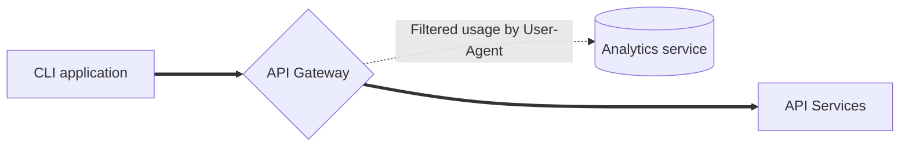
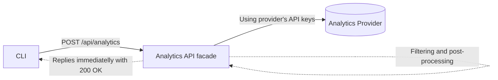

Using analytics tools to gain visibility into CLI and feature usage is an essential tool for supporting and evolving your CLI application. However, costs of collecting analytics are not trivial.

<!--more-->

Collecting analytics for CLI applications might be problematic, because of [the lifecycle of the CLI application](). Users will run old versions of your application with outdated analytics information, their network might block or modify the data being sent to your analytics and more. Some users also don't want to share their usage data.

At the same time, especially if you are running a commercial application, you want to get visibility. Not just for the product or business goals, but for **evolvability and maintainability**. Consider you just uncovered a security vulnerability in your CLI and you want to know how many users were impacted - analytics data with sufficient resolution and scope will allow you to do this.

## Analytics outside of the CLI

As you will see, **collecting analytics from CLI apps is not a small task**. Because of this, you could consider not collecting usage data from CLI directly, but from other sources.

### API metrics

If your CLI is used primarily as an API client or is relying on API usage heavily, relying on [a well-formed HTTP User-agent header]() and [API Gateway](https://en.wikipedia.org/wiki/API_management) analytics might give you good enough visibility. Consider this approach:

1. Gauge **feature usage from the calls and request bodies** you are receiving.
2. CLI **versions and used platforms** extracted from [the User-agent string]().
3. Gather user usage patterns from **API tokens or authorization** information.



You are probably already collecting such analytics from your [API Gateway](https://en.wikipedia.org/wiki/API_management) or services. Exposing them on a dashboard might give you good visibility already. This is also a good place to cross-reference and check data you might collect from CLI analytics described below.

### Marketplaces and integrations

Depending on your [CLI distribution channels]() you could gather good usage analytics from package managers and integrations. For example, [npm](https://www.npmjs.com), [Homebrew](https://formulae.brew.sh/analytics/), [Jenkins](http://stats.jenkins.io), [Docker Hub](https://hub.docker.com), and others publicly show download counts and other metrics.

{}

---

## Collecting analytics from the CLI

If external sources are not available for your application or don't provide you with enough visibility, the next step is to start collecting analytics directly from the CLI.

Collecting data from users' machines should not be taken lightly. There are security and performance aspects, legal obligations and privacy concerns.

### Privacy and legal obligations

Beyond regulatory requirements - be it [GDPR](https://en.wikipedia.org/wiki/General_Data_Protection_Regulation), [CCPA](https://en.wikipedia.org/wiki/California_Consumer_Privacy_Act) or others - **don't underestimate how sensitive _any_ data coming from users is**. You could read a folder name that contains a piece of sensitive information, [a git repository **name** containing credentials](https://git-scm.com/book/en/v2/Git-on-the-Server-Getting-Git-on-a-Server) or credentials that the user accidentally copy pasted to otherwise innocent input. **If it's user input, or any metadata read from user's machine or network, it's sensitive.**

{}

**Keep in mind when implementing analytics:**

1. **Don't collect anything you don't need**.
1. Implement **sanitization and filtering on the server side**. This way you can target already released versions of your CLI.
1. Even accidentally, _you will_ collect something you shouldn't. **Have a defined process to purge it from your data stores.**

{}

{}

#### Opt-in vs. opt-out

Be mindful when designing your analytics as opt-in or opt-out. Depending on your users, this could be a sensitive topic.

The opt-out is relatively common for CLI tools tied to a SaaS or similar product. But there are also examples from the open source, like the [opt-out approach in Homebrew](https://docs.brew.sh/Analytics). An opt-out mechanism from CLI analytics is not yet standardised, beyond attempts like [Console Do Not Track](https://consoledonottrack.com).

The opt-in approach has a chance to succeed only if your tool comes with a setup step/wizard, giving users a _Yes/No_ question. If you are not able or don't wish to ask the user, opt-out is the more viable option.

{}

### Security

Beyond the privacy and compliance headaches, there are at least two security aspects worth talking about:

- Orchestrating and collecting analytics data in the CLI adds complexity to the application. The analytics call will likely be made in an unusual place, outside of the business-logic modules, to ensure it captures all the data you want and only sends them at the end of the execution. And is also able to capture and report runtime errors. This complexity could introduce security vulnerabilities or new failure modes.
- If you are collecting anonymous analytics, you will have to expose an unprotected endpoint accepting data. This is a potential attack vector. Even for sabotage, when an actor could flood your analytics with fake data, or a malicious payload.

### Performance and reliability

To collect analytics, you need to make a network request. If not implemented well, the analytics network request will prevent CLI from exiting, leading to a _hanging_ command.

{}

**Keep in mind when implementing analytics:**

1. Fire the analytics event **as late as possible, after the command has finished**. You don't want an error in analytics to prevent the command from running.
1. Make sure your **Analytics API is reliable and fast**. Make analytics processing asynchronous - save the request to a queue and quickly respond to the CLI.
1. Implement a **_sensible_ timeout**. A few seconds tops. Ideally, from UX perspective, it might be relevant to the command execution time.
1. [CLI could encounter a complex network scenario](). The analytics call should know _enough_ about the user's network to **fail fast**. For example avoid retries, don't even fire the request if you know you won't be able to connect.

{}

### What to monitor and collect

There are many useful usage metrics you could collect from your CLI. For example:

1. Operating system, architecture and CLI version
1. Environment
   - Running in CI? In a Docker container?
   - If your application interacts or depends on other tools, checking or collecting their versions or configurations could be valuable.
1. [Exit codes]()
1. Error messages[^error-messages]: Use language features to make sure that your analytics call can be executed with sufficient information even in case of a catastrophic failure.
1. Commands and features usage
1. Execution time

Another important metric is the success rate, were users able to run a command? Did it successfully exit with 0 or something else happened? And collecting flags allows you to gauge the usage of specific features. This is important when you decide to make a Breaking Change or deprecate something.

<!-- TODO example API? -->

### Building dashboards

How your dashboards will look, will greatly depend on the kind of data you collect and the product you are trying to build. Because of [the CLI lifecycle](), you will have a [long tail](https://en.wikipedia.org/wiki/Long_tail) of versions that are sending you analytics. When interpreting the analytics data, pay attention to trends and how they relate to the version of the CLI.


For example, when observing error rates, take into account how quickly is new CLI version adopted by the users. Imagine how quickly would you spot a fatal bug in a new version. That's affecting only Windows. **Such an event would most likely not be visible on a global error rate across all versions and platforms.**

## Tooling

{}

**Error tracking** tools like [Sentry](https://sentry.io), [Bugsnag](https://www.bugsnag.com) and similar require its section. See the [CLI Debugging page]().

{}

### 3rd party analytics tools

Using tools like [Google Analytics](https://analytics.google.com/) is tempting. They are ubiquitous, well-integrated and in the case of Google Analytics also _free_. There are many issues with this approach.

They often rely on API keys or some other identifier, to properly track usage. However, this could lead to vendor lock-in. If you change the identifier or even the tracking provider, you will lose tracking data from all the previously released versions of your CLI, as they will still use the old identifier. You could work around it by providing the tracking ID through an API call, but this might introduce extra latency.

Another part of the problem with 3rd party analytics is they use their domains. In the case of Google Analytics, it's `www.google-analytics.com`. This means you are sending HTTP requests to a domain you don’t control. At best, it is a complication for integrators and security teams [configuring their firewalls, proxies or controllers for your CLI application]().

> Don't send usage events directly from your CLI to a 3rd party like Google Analytics.

A better approach is to **use a facade API endpoint** like `POST /api/analytics` hosted on your trusted (sub)domain. It is an endpoint that accepts analytics events from your application and then forwards them to the analytics provider of your choice. It's a similar approach like [Segment](https://segment.com). This way, you can change the analytics provider without losing the data. Or add new layers of processing, like sanitization, filtering or anonymization.



Once you solve all this, it is still a lacking experience. One more thing to keep in mind is that many **analytics products are geared toward tracking users on a website**. Many of the idiomatic things about tracking users on the web don’t translate well to CLI usage. You will face meaningless dimensions like page views, browser window sizes, user paths and clicks. Instead of user journeys through commands. You will have to keep hacking around and building your own dashboards and reports.

### Self-hosting analytics tools

Similar to 3rd party analytics tools, these are often aimed at tracking users on a website. But with some tweaking, you can make them work for CLI usage.

### Rolling your own

A time-consuming but flexible option is rolling your own analytics tool that will be just right for your CLI. Sending CLI events to a (No)SQL database and building your usage dashboards with tools like [Grafana](https://grafana.com), [Superset](https://superset.apache.org), [Metabase](https://www.metabase.com) or similar. Without a proper vendor for such use cases, this is at least worth considering.

## Links in the CLI output

One more area for gathering analytics is links in the CLI output. You can **use them to track usage or interest in specific features**. Since you can't capture users clicking on links in the CLI output, you could use [UTM parameters](https://en.wikipedia.org/wiki/UTM_parameters) to track usage. UTM parameters are a standard way of tracking traffic sources. They are added to the URL as query parameters. An example of a link with UTM parameters for a CLI command:

```text
https://example.com/page?utm_source=cli&utm_term=command-name
```

But links with UTM parameters **might be too odd looking or simply too long** for the output. Such links could for example cause visual issues with text wrapping. One way around this is to **use a URL shortener**. This way you can hide UTM parameters away while showing users a short URL that's easy to read and copy. You are also saving terminal screen real estate.

```text
https://example.com/page?utm_source=cli&utm_term=command-name
-> Shortened:
https://bit.ly/3ZG7o6K
```

These additional parameters could be applied to any link in the CLI output. Links in the help output, in API responses that get printed or error messages. You can generate short URLs manually beforehand, during build time or even on the API side.

Preferably, you should use a trusted (sub)domain you control for the short URLs.

[^error-messages]: If you decide to collect error messages and error logs, there will be private information included in the stack trace. You could work around this issue by collecting only predefined error messages, but this will limit your ability to debug issues.
